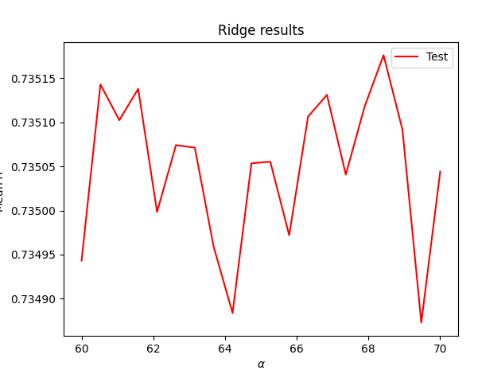
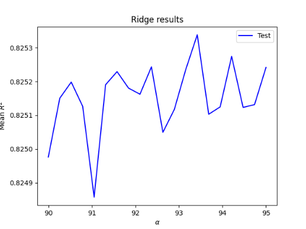

## 1 

First, I imported all the necessary libraries and created my DoKFold() function. I then imported the persons.csv data, and removed the rows that had empty values in them. This would have a bigger impact on a smaller data set, but with this data set of over 47,900 observations, removing 83 rows won't have a significant import on the results. From there, I changed the data types of the 'age' and 'edu' columns, so all the data in the data frame would be integers.

After cleaning the data, I set 'wealthC' as the target, and the rest of the columns as the features.

`X = df.drop(["wealthC", "wealthI"], axis = 1)`

`y = df.wealthC`

## 2

Computing the R2 after running a Linear Regression on the unstandardized data gives a training result of 0.7358359, and a testing R2 of 0.7351473. The training R2 is slightly larger than that of the testing data. Upon standardizing the data, the training and testing R2 values very slightly changed to 0.7358332 and 0.7351118, respectively, smaller than the unstandardized data at an almost negligible level. The unstandardized training MSE were 0.442787 and 0.443702 while the standardized MSE's were 0.442791 and 0.443646, again very similar, 

The linear coefficients of the unstandardized and standardized models differ significantly. In the unstandardized model, coefficients of the first three parameters are 3.01812923e-02,  1.07882853e-02, and -5.57603897e-04, while in the standardized model they are 1.12548658e-01,  5.24358116e-03, and -1.08884589e-02. Some coefficients increase while others decrease, suggesting that standardizing the data has a significant impact on the individual coefficients, while not greatly impacting the overall results - as the R2 and MSE values were so similar.  

## 3

Using a range of 60 to 70, I ran a Ridge regression on the data, finding an optimal alpha value at 68.421052, with a testing R2 score of 0.7358368 and a training R2 of 0.7351759. The Ridge regression produced a very slightly better model than the Linear regression, but only at the fifth decimal point.

## 4

Using a range of 0.00024 to 0.00029, I ran a Lasso regression, which after a few convergence errors, producted an optimal alpha value of 0.00025, with an R2 testing value of 0.0735835 and a training value of 0.7350895, slightly less than that of the Ridge regression results. 

## 5

I then ran the same previous three tests with the target set to 'wealthI' instead of 'wealthC'. 
For the Linear Regression model, the test produced unstandardized R2 test and train values of 0.825836 and 0.8250949, respectively, larger than the Linear Regression R2 values with the 'wealthC' target. 'wealthI' Linear Regression also produced larger MSE values. I'm not sure what is happening with the MSE in this situation, as both the train and test MSE give values in the billions - 1750174405.288178 and 1754301835.1771877. Upon standardizing, the R2 values changed to 0.825803 and 0.825101, larger than the unstandardized test value, and smaller for the train score, while both are larger than what was given using 'wealthC'. The standardized linear coefficients were much larger for the standardized data set producing the first three values of 8.64993728e+03,  5.31704713e+02, and -1.00083919e+03, in comparison to the unstandardized set, which first three values were 2.31986195e+03,  1.08192000e+03, and -5.08892487e+01, suggesting that standardizing the data allows the parameters a larger, positive impact on the target value.

Using a range of 85 to 95, the Ridge Regression using 'wealthI' produced an optimal alpha value of 93.42105 with test and train R2 values of 0.825836 and 0.8253538, larger than the output of the Linear Regression for 'wealthI', and all of the outcomes for 'wealthC'

Using a range of 0.8 to 1.2, the Lasso Regression using 'wealthI' produced an optimal alpha value of 1.06666 with test and train R2 values of 0.825835 and 0.825021, smaller than the output of the Ridge Regression for 'wealthI', and larger than all of the outcomes for 'wealthC'

## 6 

While the Ridge regression produced the best output for 'wealthC', all of the results for 'wealthI' were much higher than anything given from the 'wealthC' target, suggesting that 'wealthI' is a better fit for the model and has a higher predictability of wealth than 'wealthC'. The greater R2 values for each test run on 'wealthI' in comparison to 'wealthI' support this, demonstrating 'wealthI' is more highly correlated with the included features than 'wealthC'.

'wealthI' is clearly a better model than 'wealthC', with the Ridge Regression producing the best results; however, those results are very similar to those produced by the Lasso Regression, which is exactly what happened with the 'wealthC' target, suggesting that, of the three regression models, Lasso and Ridge perform better than Linear, with Ridge being the best of the three by a very small margin. 

The following two graphs demonstrate the optimal alpha value on the X-axis and the mean R2 on the Y-axis for the Ridge Regression of the two models, with 'wealthC' in red, and 'wealthI' in blue, showing the higher R2 values of 'wealthI' in comparison to 'wealthC'.

  <figure>
    
   </figure>

<figure>
  
</figure>

The following two graphs demonstrate the optimal alpha value for the Lasso Regression of the two models, with 'wealthC' in red, and 'wealthI' in blue, showing the higher R2 values of 'wealthI' in comparison to 'wealthC'.

<figure>
  
</figure>

<figure>
  
</figure>
